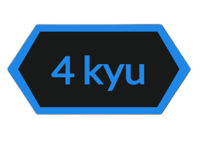
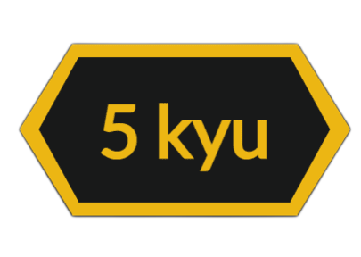
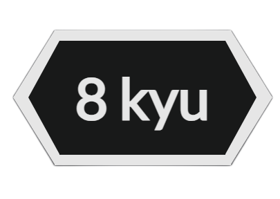

# CodeWars Challenges

  

 

Welcome to my CodeWars challenges repository! Here you can find solutions to various programming challenges from CodeWars, organized by difficulty level.

  

 

Table of Contents

- [CodeWars Challenges](#codewars-challenges)
  - [About CodeWars](#about-codewars)
  - [Difficulty Levels](#difficulty-levels)
  - [Katas summary](#katas-summary)
  - [How to Use](#how-to-use)

## About CodeWars

CodeWars is a community of developers, who are called Code Warriors (or just warriors), that train on improving their development skills. Think of it like a coding dojo - where developers train with each other and help each other get better through practice.

## Difficulty Levels

&nbsp;&nbsp;&nbsp;
&nbsp;&nbsp;&nbsp;
&nbsp;&nbsp;&nbsp;
&nbsp;&nbsp;&nbsp;

 

&nbsp;&nbsp;&nbsp;
&nbsp;&nbsp;&nbsp;
&nbsp;&nbsp;&nbsp;
&nbsp;&nbsp;&nbsp;

## Katas summary

...

## How to Use

- Each challenge is in its dedicated file within the `challenges` folder.
- Check the challenge description and solution in the respective files.

Feel free to explore the solutions and provide feedback!

Happy coding!
